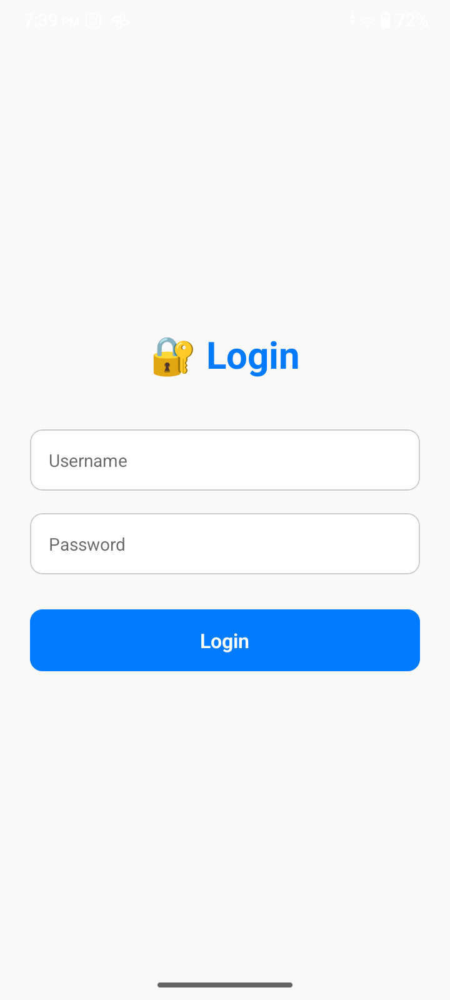
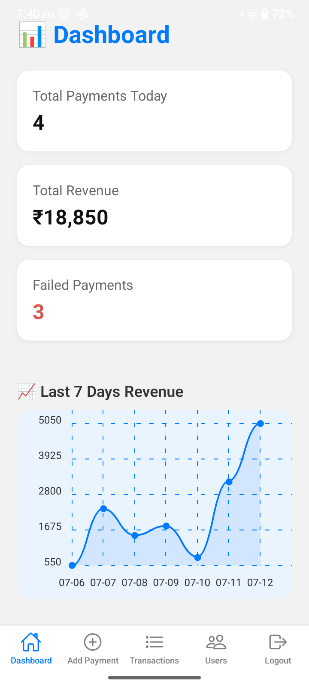
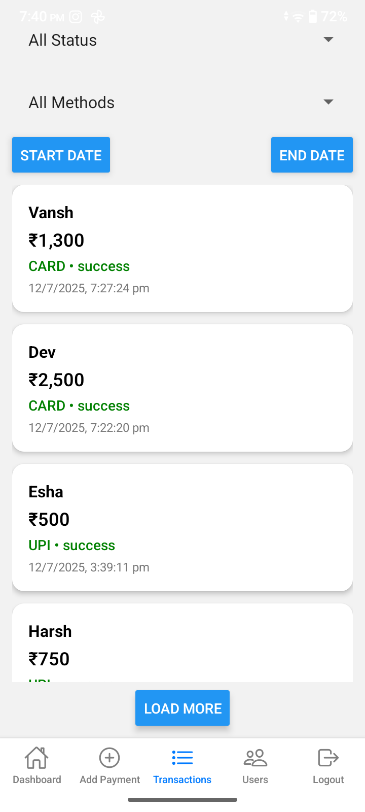
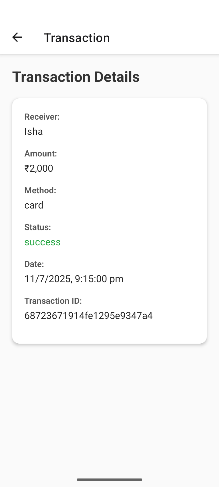
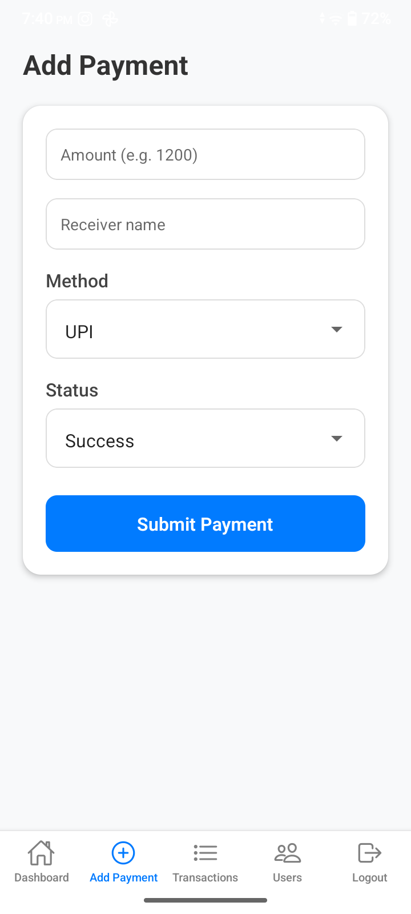
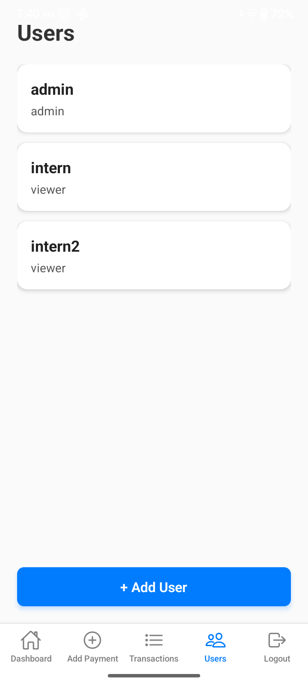
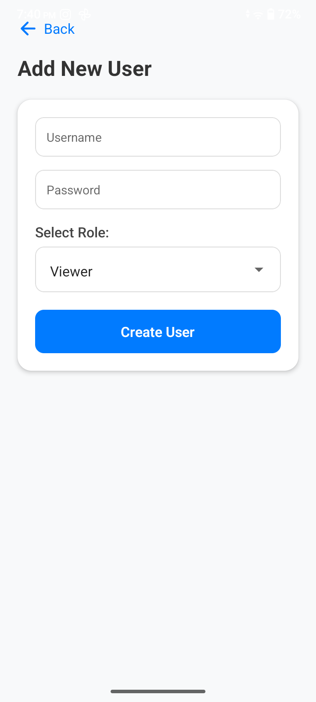

# 💸 Payment Dashboard App

A full-stack mobile app to track payments, manage users, and view analytics. Built with React Native (Expo) and NestJS.

---

## ✨ Features

- 🔐 Login with JWT
- 👤 Admin & Viewer roles (RBAC)
- 📊 Dashboard with revenue stats and charts
- 🔍 Filterable, paginated transaction list
- ➕ Add payments
- 🧾 View payment details
- 👥 Manage users (Admin only)
- 📱 Clean UI (mobile + responsive)

---

## 🧰 Tech Stack

| Layer       | Technology                  |
|-------------|-----------------------------|
| Frontend    | React Native (Expo)         |
| Backend     | NestJS + MongoDB            |
| Charts      | react-native-chart-kit      |
| Auth        | JWT + SecureStore           |
| Navigation  | React Navigation (Stack + Tabs) |
| UI Icons    | Ionicons                    |

---

## 📷 App Screenshots

> Light, responsive UI with native feel

### 🔐 Login  


### 📊 Dashboard  


### 📋 Transactions List  


### 📄 Transaction Details  


### ➕ Add Payment  


### 👥 Users List *(Admin)*  


### ➕ Add User *(Admin)*  



---

## 🚀 Setup Instructions

### 1️⃣ Backend (NestJS)

```bash
git clone https://github.com/Devarora13/Payment-Dashboard-App.git
cd server
npm install
```

Create `.env` file:

```env
PORT=3000
JWT_SECRET=your_jwt_secret
MONGO_URI=mongodb://localhost:27017/payments
```

Run backend:

```bash
npm run start:dev
```

> API Base URL: `http://localhost:3000`

---

### 2️⃣ Frontend (React Native + Expo)

```bash
git clone https://github.com/Devarora13/Payment-Dashboard-App.git
cd client
npm install
```

Update `constants/constant.ts`:

```ts
export const API_BASE_URL = 'http://localhost:3000'; // or local IP for device testing
```

Start Expo:

```bash
npx expo start
```

---

## 📡 API Endpoints

> All protected routes require `Authorization: Bearer <token>`

### Auth

- `POST /auth/login`

```json
{ "username": "admin", "password": "admin123" }
```

---

### Users (Admin only)

- `GET /users` – Get all users  
- `POST /users` – Create a user

```json
{
  "username": "john",
  "password": "123456",
  "role": "viewer"
}
```

---

### Payments

- `GET /payments` – With filters: `status`, `method`, `startDate`, `endDate`, `page`
- `POST /payments`

```json
{
  "amount": 1200,
  "receiver": "Alice",
  "method": "upi",
  "status": "success"
}
```

---

### Stats

- `GET /payments/stats`

```json
{
  "totalToday": 5,
  "totalRevenue": 7800,
  "failedCount": 1,
  "last7Days": [
    { "_id": "2025-07-10", "total": 1200 },
    ...
  ]
}
```

---

## 🔑 Sample Credentials

| Role    | Username | Password   |
|---------|----------|------------|
| Admin   | admin    |  admin123  |
| Viewer  | intern2  |  intern123 |

---


## 📌 Notes

- Expo SecureStore is used to store tokens securely.
- MongoDB required to be running locally or via MongoDB Atlas.
- Mobile device access requires using local IP instead of `localhost`.

---
